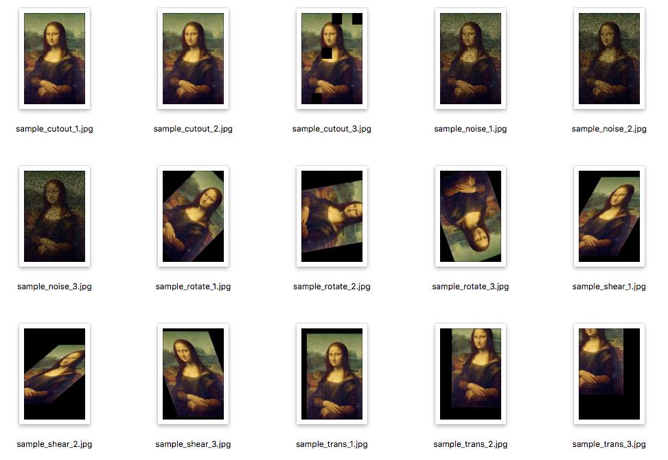

# imgaug_sample_with_docker

imgaug を使うサンプルプログラム（実行環境 docker 付き）

機械学習のための画像水増しライブラリ [imgaug](https://github.com/aleju/imgaug) を使ってみたというサンプルと、docker による実行環境。

## こんな感じ

**入力**


**出力**



## 使い方

### 前提

* Docker 環境(Docker version 18.09.0 で確認済み)

### Docker イメージの作成(初回のみ)

1. このリポジトリを clone
2. ``cd imageaug_sample_with_docker``
3. ``docker build . imgaug``

ここまでで、 imgaug という docker イメージが作成されます。

```bash
$ docker images

REPOSITORY          TAG                 IMAGE ID            CREATED             SIZE
imgaug              latest              1fb215f98c9a        About an hour ago   1.41GB
python              3                   1e80caffd59e        3 weeks ago         923MB
```

### Docker 内で imgaug の実行

```bash
docker run --rm -it -v $(pwd):/temp imgaug python /temp/work/run_aug.py
```

``images_in/`` ディレクトリにあるファイル群を水増しして、結果を ``images_out/`` ディレクトリに出力します。

## 参考

* [imgaugを使ってPythonで画像増幅を行う ｜ DevelopersIO](https://dev.classmethod.jp/etc/imgaug-introduction/)
